# 基于SpringBoot+Docker+Dubbo 微服务商城

                

本项目是我的毕设项目，可以用来练练手

## I. 导入工程

### 克隆代码仓库

```bash
git clone https://github.com/gulihua10010/eshop
```

### IDEA导入工程

1. 打开IDEA，选择导入项目，选中克隆的仓库本地所在目录；

    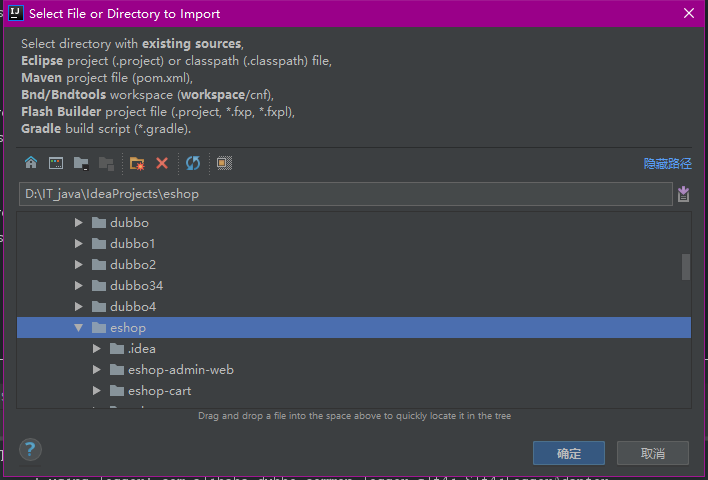

2. 选择Maven进行导入；

    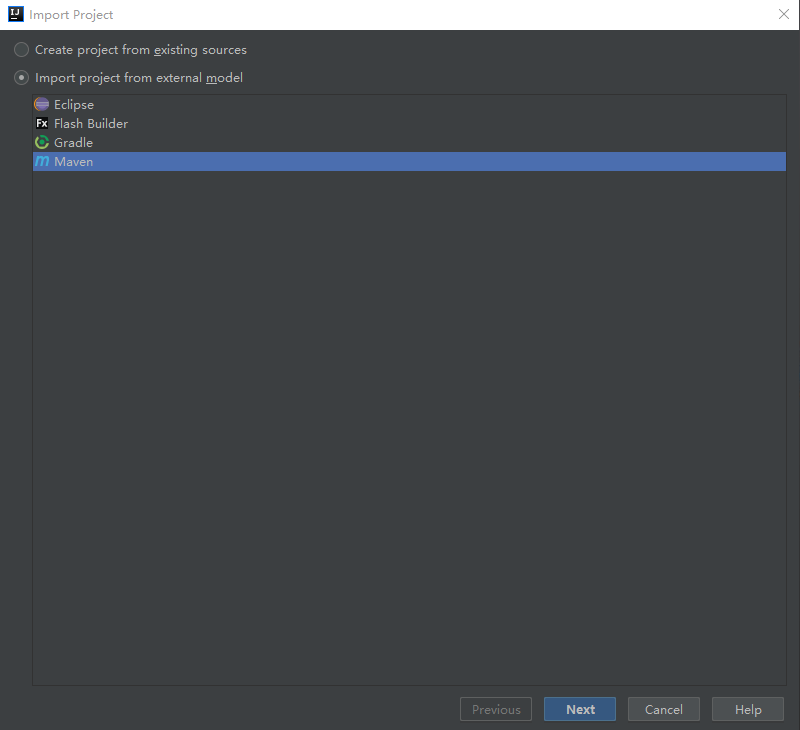

3. 利用Maven导入项目前进行相关配置；

   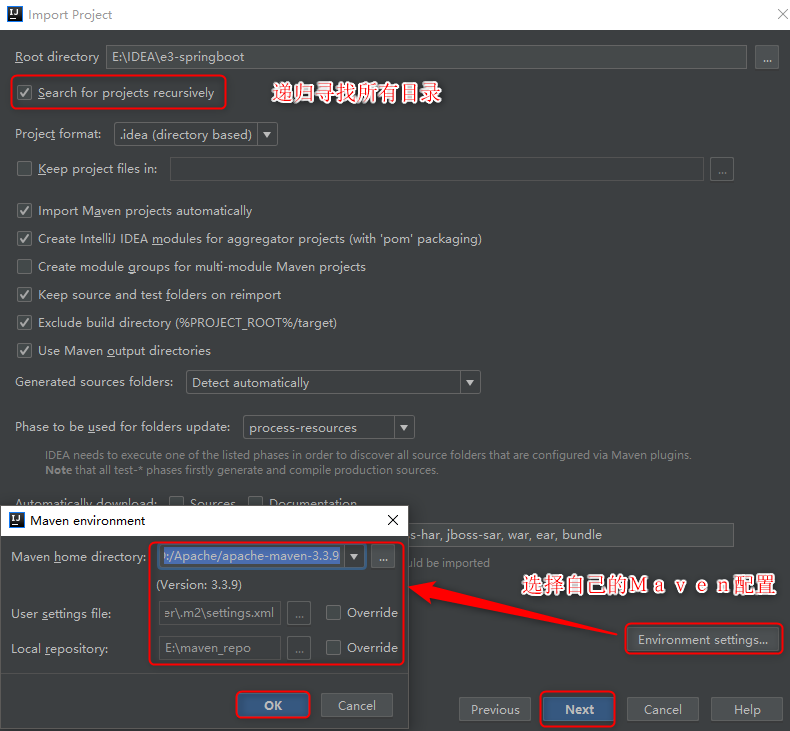

4. 然后选中所有模块进行导入即可，导入成功后可以浏览 Maven Projects 视图。

   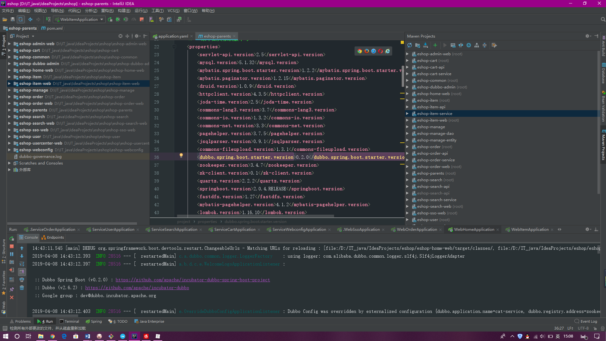

### 搭建运行环境

1. CentOS系统下安装 Docker；(我是windows环境下安装Docker Toolbox，

   [地址]: https://mirrors.aliyun.com/docker-toolbox/windows/docker-toolbox/

   )

2. 利用 Docker 安装MySQL、ZooKeeper、FastDFS、Redis、Solr 和 ActiveMQ。

注：具体参考 下面内容教程

### 修改配置文件

1. 修改项目所有的 *ip* 地址；
2. 修改数据库连接用户名、密码。

### 启动所有模块

1. 启动所有容器实例；

   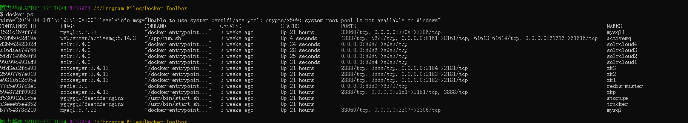

2. 启动所有Dubbo服务；

   | 服务                                                         | 模块     |
   | :----------------------------------------------------------- | :------- |
   | cn.jianwoo.eshop.webconfig.service.ServiceWebconfigApplication | 网站配置 |
   | cn.jianwoo.eshop.service.ServiceSearchApplication            | 搜索     |
   | cn.jianwoo.eshop.user.service.ServiceUserApplication         | 用户     |
   | cn.jianwoo.eshop.cart.service.ServiceCartApplication         | 购物车   |
   | cn.jianwooeshop.order.service.ServiceOrderApplication        | 订单     |
   | cn.jianwoo.eshop.item.service.ServiceItemApplication         | 商品     |
   |                                                              |          |

3. 启动所有Web应用。

   | Web                                               | 模块      | 地址                                             |
   | ------------------------------------------------- | --------- | ------------------------------------------------ |
   | cn.jianwoo.eshop.adminweb.WebAdminAppApplication  | 后台      | [http://localhost:8080/](http://localhost:808/)  |
   | cn.jianwoo.eshop.home.WebHomeApplication          | 首页      | [http://localhost:8010/](http://localhost:8010/) |
   | cn.jianwoo.eshop.search.web.WebSerarchApplication | 搜索      | [http://localhost:8009/](http://localhost:8009/) |
   | cn.jianwoo.eshop.item.web.WebItemApplication      | 商品详情  | [http://localhost:8003/](http://localhost:8003/) |
   | cn.jianwoo.eshop.sso.web.WebSsoApplication        | 单点登录  | [http://localhost:8004/](http://localhost:8004/) |
   | cn.jianwoo.eshop.order.web.WebOrderApplication    | 订单      | [http://localhost:8005/](http://localhost:8005/) |
   | com.alibaba.dubboadmin.DubboAdminApplication      | Dubbo监控 | [http://localhost:7001/](http://localhost:7001/) |


## II. 网站截图

### 后台

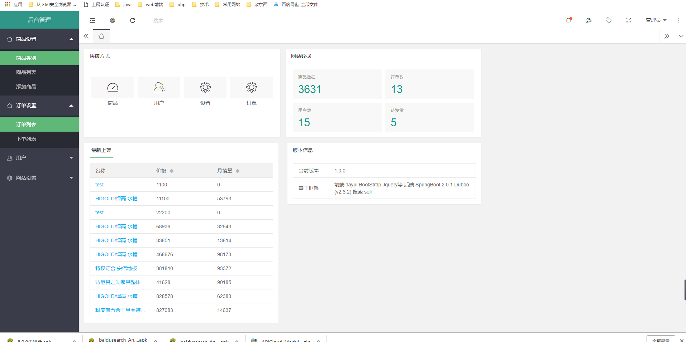

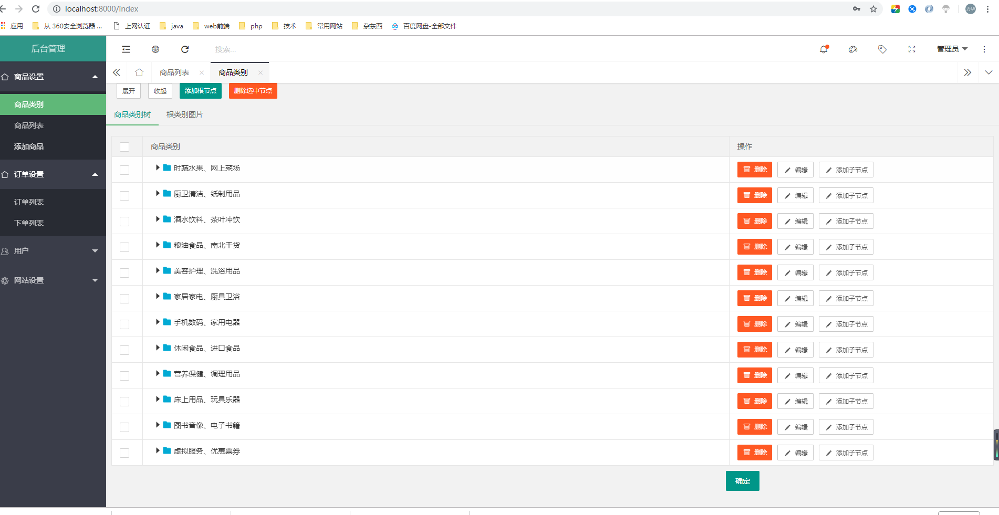

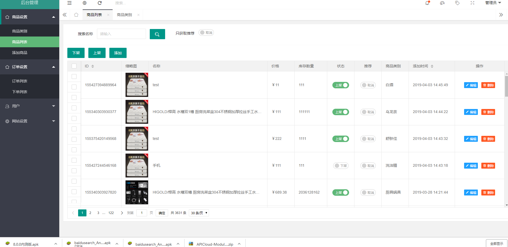


### 前台首页

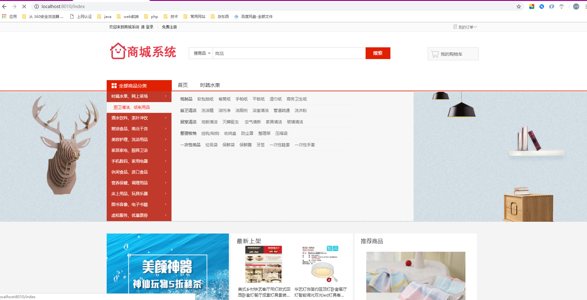


### 商品详情


### 单点登录


### 注册

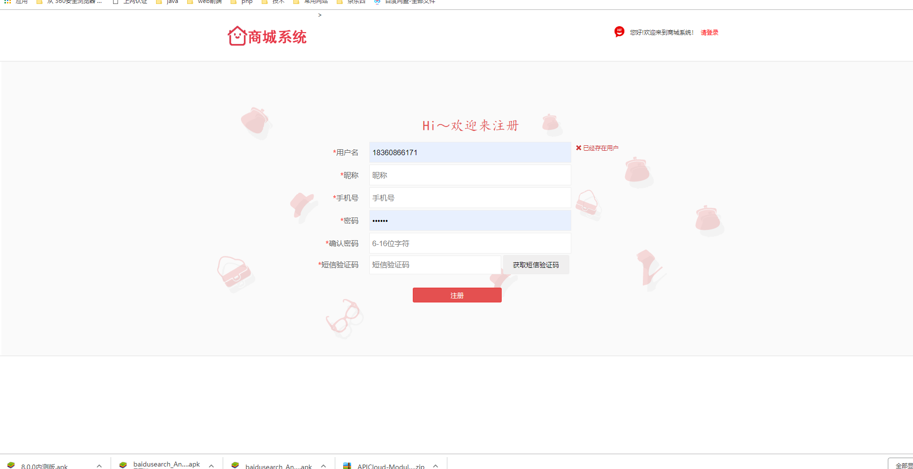

### 购物车

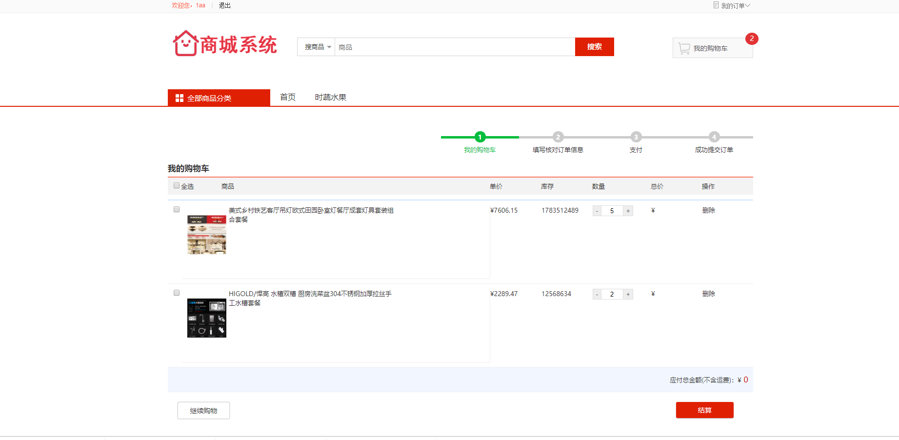

### 订单

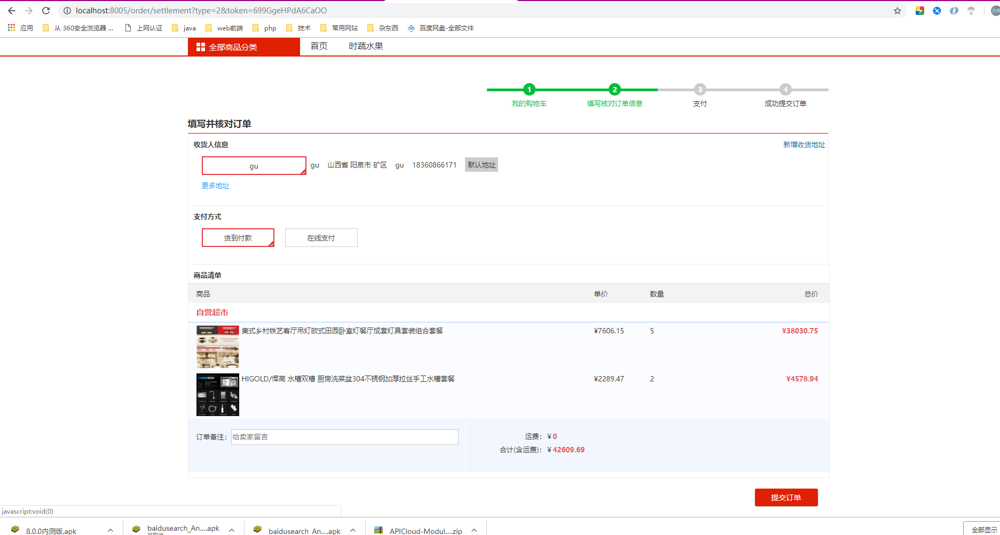

### 个人中心

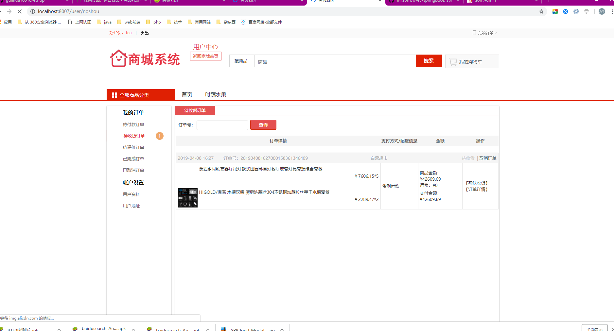

## III. 项目教程

### 搭建工程

1. Intellj IDEA创建空项目(New Project) ***eshop***；

2. 创建其他模块(New Module)；

   | 模块名               | 打包方式 |
   | :------------------- | :------- |
   | eshop-parent         | pom      |
   | eshop-common         | jar      |
   | eshop-manager        | pom      |
   | eshop-manager-entity | jar      |
   | eshop-manager-dao    | jar      |

   除 *eshop-parent* 外其他所有模块父工程都为 *eshop-parent，* *eshop-parent* 的父工程为 *spring-boot-starter-parent*。由于使用spring boot框架，web模块打包方式也为jar。

   注：后面引入Dubbo时会进行变动。

3. *eshop-manager-web* 模块的maven插件配置利用：

   ```xml
   <plugins>
       <plugin>
           <groupId>org.springframework.boot</groupId>
           <artifactId>spring-boot-maven-plugin</artifactId>
       </plugin>
   </plugins>
   ```

   其他模块的maven插件配置利用：

   ```xml
   <plugins>
       <!-- 资源文件拷贝插件 -->
       <plugin>
           <groupId>org.apache.maven.plugins</groupId>
           <artifactId>maven-resources-plugin</artifactId>
           <version>2.7</version>
           <configuration>
               <encoding>UTF-8</encoding>
           </configuration>
       </plugin>
       <!-- java编译插件 -->
       <plugin>
           <groupId>org.apache.maven.plugins</groupId>
           <artifactId>maven-compiler-plugin</artifactId>
           <version>3.2</version>
           <configuration>
               <source>1.7</source>
               <target>1.7</target>
               <encoding>UTF-8</encoding>
           </configuration>
       </plugin>
   </plugins>
   ```

### 安装MySQL

1. [CentOS 7安装Docker CE](https://docs.docker.com/install/linux/docker-ce/centos/)；

   ```bash
   # SET UP THE REPOSITORY AND INSTALL DOCKER CE
   sudo yum install -y yum-utils device-mapper-persistent-data lvm2
   sudo yum-config-manager --add-repo https://download.docker.com/linux/centos/docker-ce.repo
   sudo yum install -y docker-ce
   sudo systemctl enable docker
   sudo systemctl start docker
   # Manage Docker as a non-root user
   sudo groupadd docker
   sudo usermod -aG docker $USER
   # log out and log back in
   ```

2. [拉取MySQL镜像](https://hub.docker.com/r/library/mysql/tags/)；

   ```bash
   docker pull mysql:5.7.23
   ```

3. 启动MySQL容器（设置密码、端口映射）；

   ```bash
   docker run --name 实例名称 -p 3307:3306 -e MYSQL_ROOT_PASSWORD=密码 -d mysql:5.7.23 --character-set-server=utf8mb4 --collation-server=utf8mb4_unicode_ci
   ```

4. 授权

   ```bash
   	 ALTER USER 'root'@'%' IDENTIFIED BY 'root';
   	 GRANT ALL PRIVILEGES ON *.* TO 'root'@'%';
   ```

   

5. 开启3306端口防火墙；

   ```bash
   firewall-cmd --zone=public --add-port=3306/tcp --permanent
   firewall-cmd --reload
   ```

6. 客户端（Navicat）连接MySQL容器。

   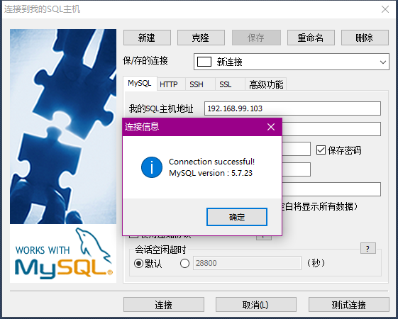

### 整合MyBatis

1. *eshop-parent* 相关依赖；

   ```xml
   
       <!-- 集中定义依赖版本号 -->
       <properties>
           <servlet-api.version>2.5</servlet-api.version>
           <mysql.version>5.1.32</mysql.version>
           <mybatis.spring.boot.starter.version>1.2.2</mybatis.spring.boot.starter.version>
           <mybatis.paginator.version>1.2.15</mybatis.paginator.version>
           <druid.version>1.0.9</druid.version>
           <httpclient.version>4.3.5</httpclient.version>
           <joda-time.version>2.5</joda-time.version>
           <commons-lang3.version>3.7</commons-lang3.version>
           <commons-io.version>1.3.2</commons-io.version>
           <commons-net.version>3.3</commons-net.version>
           <pagehelper.version>3.7.5</pagehelper.version>
           <jsqlparser.version>0.9.1</jsqlparser.version>
           <commons-fileupload.version>1.3.1</commons-fileupload.version>
           <dubbo.spring.boot.starter.version>0.2.0</dubbo.spring.boot.starter.version>
           <zookeeper.version>3.4.7</zookeeper.version>
           <zk-client.version>0.1</zk-client.version>
           <quartz.version>2.2.2</quartz.version>
           <springboot.version>2.0.4.RELEASE</springboot.version>
           <fastdfs.version>1.27</fastdfs.version>
           <mybatis-pagehelper.version>4.1.2</mybatis-pagehelper.version>
           <lombok.version>1.16.10</lombok.version>
           <httpclient.version>4.3.5</httpclient.version>
       </properties>
   
       <dependencyManagement>
           <dependencies>
               <!-- httpclient -->
               <dependency>
                   <groupId>org.apache.httpcomponents</groupId>
                   <artifactId>httpclient</artifactId>
                   <version>${httpclient.version}</version>
               </dependency>
               <!--for page-->
               <dependency>
                   <groupId>com.github.pagehelper</groupId>
                   <artifactId>pagehelper</artifactId>
                   <version>${mybatis-pagehelper.version}</version>
               </dependency>
               <dependency>
                   <groupId>org.springframework.session</groupId>
                   <artifactId>spring-session-data-redis</artifactId>
               </dependency>
               <!--lombok-->
               <dependency>
                   <groupId>org.projectlombok</groupId>
                   <artifactId>lombok</artifactId>
                   <version>${lombok.version}</version>
               </dependency>
               <!-- 时间操作组件 -->
               <dependency>
                   <groupId>joda-time</groupId>
                   <artifactId>joda-time</artifactId>
                   <version>${joda-time.version}</version>
               </dependency>
               <!-- Apache工具组件 -->
               <dependency>
                   <groupId>org.apache.commons</groupId>
                   <artifactId>commons-lang3</artifactId>
                   <version>${commons-lang3.version}</version>
               </dependency>
               <dependency>
                   <groupId>org.apache.commons</groupId>
                   <artifactId>commons-io</artifactId>
                   <version>${commons-io.version}</version>
               </dependency>
               <dependency>
                   <groupId>commons-net</groupId>
                   <artifactId>commons-net</artifactId>
                   <version>${commons-net.version}</version>
               </dependency>
               <!--servlet-->
               <dependency>
                   <groupId>javax.servlet</groupId>
                   <artifactId>servlet-api</artifactId>
                   <version>${servlet-api.version}</version>
                   <scope>provided</scope>
               </dependency>
               <!-- httpclient -->
               <dependency>
                   <groupId>org.apache.httpcomponents</groupId>
                   <artifactId>httpclient</artifactId>
                   <version>${httpclient.version}</version>
               </dependency>
               <!-- quartz任务调度框架 -->
               <dependency>
                   <groupId>org.quartz-scheduler</groupId>
                   <artifactId>quartz</artifactId>
                   <version>${quartz.version}</version>
               </dependency>
               <!-- Mybatis -->
               <dependency>
                   <groupId>org.mybatis.spring.boot</groupId>
                   <artifactId>mybatis-spring-boot-starter</artifactId>
                   <version>${mybatis.spring.boot.starter.version}</version>
               </dependency>
               <dependency>
                   <groupId>com.github.miemiedev</groupId>
                   <artifactId>mybatis-paginator</artifactId>
                   <version>${mybatis.paginator.version}</version>
               </dependency>
               <dependency>
                   <groupId>com.github.pagehelper</groupId>
                   <artifactId>pagehelper</artifactId>
                   <version>${pagehelper.version}</version>
               </dependency>
               <!-- MySql -->
               <dependency>
                   <groupId>mysql</groupId>
                   <artifactId>mysql-connector-java</artifactId>
                   <version>${mysql.version}</version>
               </dependency>
   
               <!-- 连接池 -->
               <dependency>
                   <groupId>com.alibaba</groupId>
                   <artifactId>druid</artifactId>
                   <version>${druid.version}</version>
               </dependency>
               <!-- 文件上传组件 -->
               <dependency>
                   <groupId>commons-fileupload</groupId>
                   <artifactId>commons-fileupload</artifactId>
                   <version>${commons-fileupload.version}</version>
               </dependency>
               <!--fastdfs-->
               <dependency>
                   <groupId>cn.bestwu</groupId>
                   <artifactId>fastdfs-client-java</artifactId>
                   <version>${fastdfs.version}</version>
               </dependency>
               <!--Dubbo-->
               <dependency>
                   <groupId>com.alibaba.boot</groupId>
                   <artifactId>dubbo-spring-boot-starter</artifactId>
                   <version>${dubbo.spring.boot.starter.version}</version>
               </dependency>
               <!--zookeeper-->
               <dependency>
                   <groupId>org.apache.zookeeper</groupId>
                   <artifactId>zookeeper</artifactId>
                   <version>${zookeeper.version}</version>
               </dependency>
               <dependency>
                   <groupId>com.github.sgroschupf</groupId>
                   <artifactId>zkclient</artifactId>
                   <version>${zk-client.version}</version>
               </dependency>
           </dependencies>
       </dependencyManagement>
   ```

   

2. 在 每个 `application.yaml` 配置数据库连接信息，以及Druid连接池；

   ```yaml
   spring:
     datasource:
       username: root
       password: root
       url: jdbc:mysql://192.168.99.103:3308/mymall
       driver-class-name: com.mysql.jdbc.Driver
       type: com.alibaba.druid.pool.DruidDataSource
   
   ```

### Zookeeper

1. [拉取ZooKeeper镜像](https://hub.docker.com/_/zookeeper/)；

   ```bash
   docker pull zookeeper:3.4.13
   ```

2. 启动ZooKeeper实例用于Dubbo的注册中心；

   ```bash
   docker run --name 容器名称 -p 2181:2181 --restart always -d zookeeper:3.4.13
   ```

   


### 图片服务器

1. 了解[Nginx](https://blog.csdn.net/bskfnvjtlyzmv867/article/details/80682470)与[FastDFS](https://blog.csdn.net/bskfnvjtlyzmv867/article/details/80714435)；

2. [拉取FastDFS镜像](https://hub.docker.com/r/morunchang/fastdfs/)；

   ```bash
   docker pull   ygqygq2/fastdfs-nginx
   ```

3. 运行tracker实例；

   ```bash
   		docker run -dti --network=host --restart always --name tracker   ygqygq2/fastdfs-nginx tracker 
   ```

4. 运行storage实例；

   ```bash
    	docker run -dti --network=host --restart always  --name storage -e TRACKER_SERVER=192.168.99.103:22122 ygqygq2/fastdfs-nginx storage
   ```

5. 修改nginx的配置，不拦截上传内容；

   ```bash
   # 1. 进入容器
   docker exec -it storage  /bin/bash
   # 2. 编辑nginx配置文件
   vim /usr/local/nginx/conf/nginx.conf
   # 3. 修改以下内容
   #user nobody;
   worker_processes 1;
   events {
       worker_connections 1024;
   }
   http {
       include mime.types;
       default_type application/octet-stream;
       sendfile on;
       keepalive_timeout 65;
       server {
           listen 8888;
           server_name localhost;
           location ~/group([0-9])/M00 {
               ngx_fastdfs_module;
           }
           error_page 500 502 503 504 /50x.html;
    
           location = /50x.html {
               root html;
           }
       }
   }
    # 4. 退出
    exit
    # 5. 重启storage容器
    docker restart  storage
   ```

    

   

6. docker内测试

   ```bash
   $ docker exec -it storage bash
   time="2019-04-08T15:44:35+08:00" level=info msg="Unable to use system certificate pool: crypto/x509: system root pool is not available on Windows"
   [root@default fastdfs-nginx-module]# ls
   [root@default fastdfs-nginx-module]# cd /
   [root@default /]# ls
   1.txt  anaconda-post.log  bin  dev  etc  home  lib  lib64  media  mnt  nginx_conf  opt  proc  root  run  sbin  srv  sys  tmp  usr  var
   [root@default /]# /usr/bin/fdfs_upload_file /etc/fdfs/client.conf 1.txt
   group1/M00/00/01/wKhjZ1yq_BeAKNFBAAAAAAAAAAA812.txt
   [root@default /]#
   
   ```

   

7. 开启防火墙 80、8080、22122、23000四个端口；

   ```bash
   firewall-cmd --zone=public --add-port=80/tcp --permanent
   firewall-cmd --zone=public --add-port=8080/tcp --permanent
   firewall-cmd --zone=public --add-port=22122/tcp --permanent
   firewall-cmd --zone=public --add-port=23000/tcp --permanent
   firewall-cmd --reload
   ```

8. 测试图片上传（创建配置文件、添加上传工具类 `FastDFSClient.java` 和测试类 `FastDFSTest.java`）。

   ```java
   @RunWith(SpringRunner.class)
   @SpringBootTest
   public class FastDFSTest {
       @Test
       public void testFastDfsClient() throws Exception {
           FastDFSClient fastDFSClient = new FastDFSClient("D:\IT_java\IdeaProjects\eshop\eshop-admin-web\src\main\resources\conf\fastdfs-client.conf");
           String file = fastDFSClient.uploadFile("D:\\1.png");
           System.out.println(file);
       }
   }
   ```

   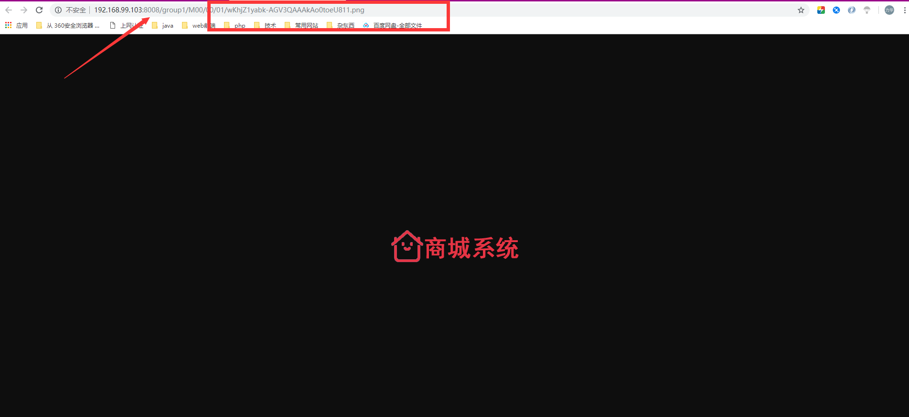

### 安装Redis


**安装单机版Redis**

1. [拉取Redis镜像](https://hub.docker.com/_/redis/)；

   ```bash
   docker pull redis:3.2
   ```

2. 启动Redis容器；

   ```bash
   docker run -d -p 6379:6379 --name  redis redis:3.2
   ```

3. 开启6379端口；

4. 测试连接。

    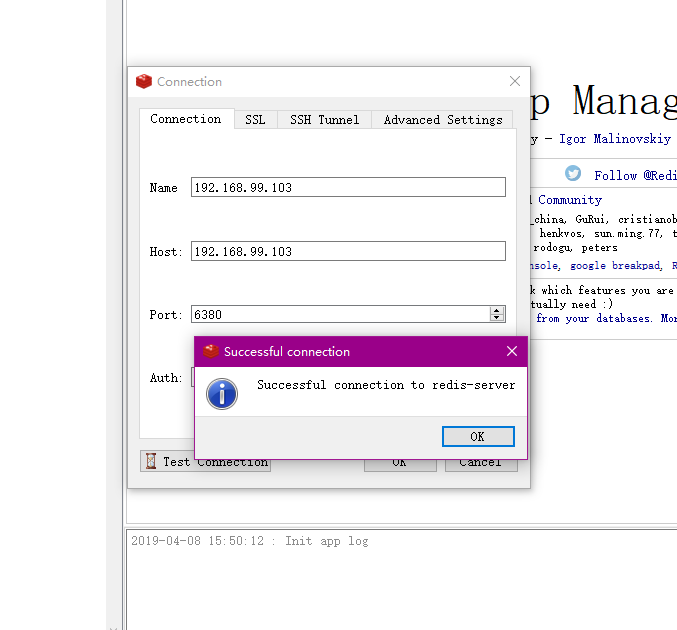

**安装集群版Redis**（一主两备）

1. [了解Docker容器 ***--link*** 参数的意义](https://www.jianshu.com/p/21d66ca6115e)；

2. 本地下载对应版本的redis压缩包（我是3.2的镜像），解压出 *redis.conf* 模板文件，拷贝三份 `redis-master.conf`、`redis-slave1.conf` 和 `redis-slave2.conf` 进行修改；

   ```properties
   # redis-master.conf 需要修改部分
   daemonize yes
   pidfile /var/run/redis.pid
   bind 0.0.0.0 # 原来是bind 127.0.0.1
   protected-mode no
   
   # redis-slave1.conf 需要修改部分
   daemonize yes
   pidfile /var/run/redis.pid
   slaveof master 6379 # 注释打开
   protected-mode no
   
   # redis-slave2.conf 需要修改部分
   daemonize yes
   pidfile /var/run/redis.pid
   slaveof master 6379 # 注释打开
   protected-mode no
   
   ```

   其中，`slaveof master 6379` 默认被注释，需要我们打开注释修改，master在这里充当 *ip* 的角色，后面利用 *--link* 参数来配置redis主机的别名为 *master*，用以让从机进行识别。

3. 创建redis集群容器，一主两备，备份机通过 *--link* 连接主机；

   ```bash
    docker run -d -p 6379:6379 --name  redis redis:3.2
   	docker run -it -p 6380:6379   --name  redis-master redis:3.2 /bin/bash
       docker run -it -p 6381:6379 --name redis-slave1 --link redis-master:master redis:3.2 /bin/bash
       docker run -it -p 6382:6379 --name redis-slave2 --link redis-master:master redis:3.2 /bin/bash
   ```

   其中，`/usr/local/redis` 目录是我在宿主机存放三个配置文件的目录，启动好一个容器可以 `Ctrl+P` 和 `Ctrl+Q` 进行退出创建下一个容器。

4. 启动redis服务。先启动 `master` ，然后启动 `slaver` 。在三个容器中都输入：

   ```bash
   redis-server /usr/local/etc/redis/redis.conf
   ```

5. 测试集群搭建情况。

   ```bash
   redis-cli
   127.0.0.1:6379> info
   ```

   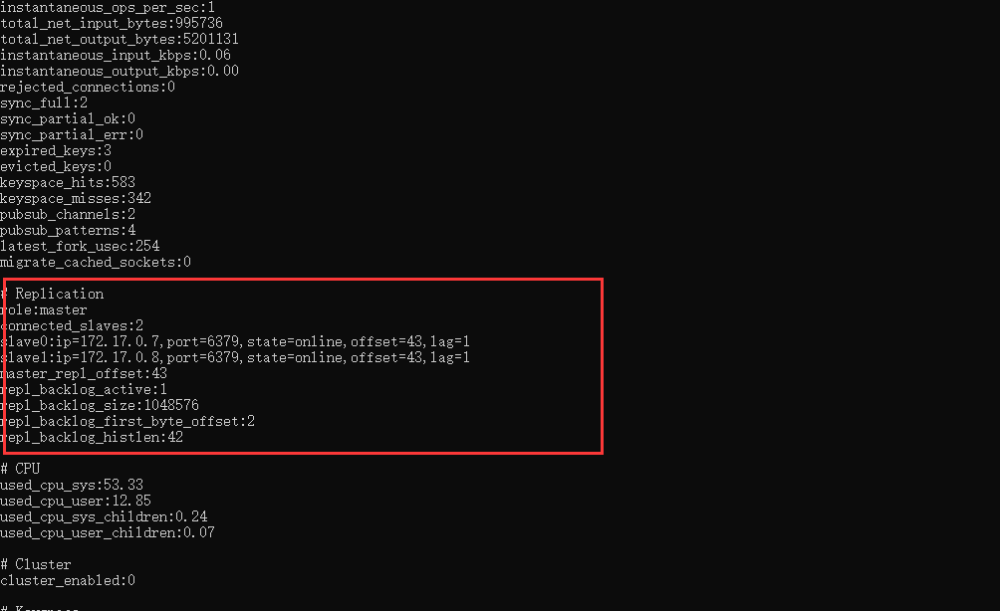

### Solr检索

 

**安装单机版Solr**

1. [拉取 *Solr* 镜像](https://hub.docker.com/_/solr/)；

   ```bash
   docker pull solr:7.4.0
   ```

2. 启动 *Solr* 容器，即可访问 http://ip:8983/ ；

   ```bash
    	docker run --name solr -d -p 8983:8983 -t solr:7.4.0
   ```

3. 新建 SolrCore，名称为 *collection1*；

   ```bash
   docker exec -it --user=solr  solr bin/solr create_core -c collection1
   ```

4. 为了方便后续修改配置，将容器 solr 文件拷贝本地 `/usr/local/solr/`；

   ```bash
   docker cp  solr:/opt/solr/ /usr/local/ # 容器拷贝宿主机
   ```

5. 设置中文分词 *smartcn*；

   - 进入容器 `docker exec -it  solr /bin/bash` ；

   - 定位Solr7自带的中文分词器 *smartcn* 的jar包位置 `/opt/solr/contrib/analysis-extras/lucene-libs`；

   - 进入创建的 *solrcore: collection1* 配置目录 `/opt/solr/server/solr/collection1/conf` ，修改 `solrconfig.xml` 添加 *smartcn* 包的 `lib` 标签；

     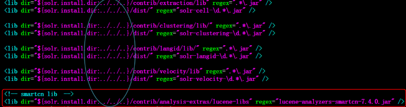

   - 在 `managed-schema` 中添加中文分词的 FieldType ；

     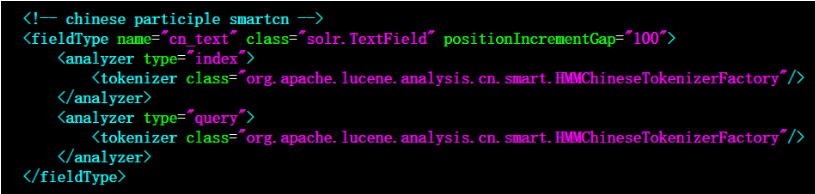

   - 上传配置，重启solr服务。

     ```bash
     docker cp /usr/local/solr/server/solr/collection1/conf/solrconfig.xml solr:/opt/solr/server/solr/collection1/conf/solrconfig.xml
     docker cp /usr/local/solr/server/solr/collection1/conf/managed-schema  solr:/opt/solr/server/solr/collection1/conf/managed-schema
     docker restart  solr
     ```

     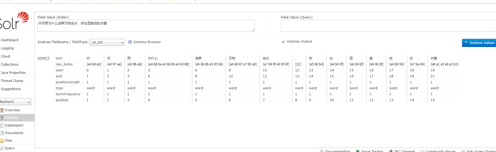


**安装集群版Solr**

1. CNM 新建 Docker 自定义网络；

   ```bash
    docker network create  zks  
   ```

2. Docker 容器搭建 ZooKeeper 集群（3个实例）；

   ```bash
      docker run -d --restart=always -p 2182:2181 -e ZOO_MY_ID=1 -e ZOO_SERVERS="server.1=zk1:2888:3888 server.2=zk2:2888:3888 server.3=zk3:2888:3888" --name=zk1 --net=zks --privileged zookeeper:3.4.13
       docker run -d --restart=always -p 2183:2181  -e ZOO_MY_ID=2 -e ZOO_SERVERS="server.1=zk1:2888:3888 server.2=zk2:2888:3888 server.3=zk3:2888:3888"  --name=zk2 --net=zks --privileged   zookeeper:3.4.13
   	docker run -d --restart=always -p 2184:2181 -e ZOO_MY_ID=3  -e ZOO_SERVERS="server.1=zk1:2888:3888 server.2=zk2:2888:3888 server.3=zk3:2888:3888" --name=zk3 --net=zks --privileged zookeeper:3.4.13
   	
   ```

3. 查看ZooKeeper集群搭建状态。

   ```bash
   # 宿主机执行命令 可能需要先安装nc(yum -y install nc)
   echo stat|nc 127.0.0.1 2182
   echo stat|nc 127.0.0.1 2183
   echo stat|nc 127.0.0.1 2184
   ```

4. 搭建 Solr Cloud（4个实例）；

   ```bash
     # 启动实例1
   	docker run --name  solrcloud1 --net=zks -d -p 8984:8983 solr:7.4.0 bash -c '/opt/solr/bin/solr start -f -z  zk1:2181,zk2:2181,zk3:2181' 
   	# 启动实例2
   	docker run --name  solrcloud2 --net=zks -d -p 8985:8983 solr:7.4.0 bash -c '/opt/solr/bin/solr start -f -z  zk1:2181,zk2:2181,zk3:2181' 
   	# 启动实例3
   	docker run --name solrcloud3 --net=zks -d -p 8986:8983 solr:7.4.0 bash -c '/opt/solr/bin/solr start -f -z  zk1:2181,zk2:2181,zk3:2181' 
   	# 启动实例4
   	docker run --name solrcloud4 --net=zks -d -p 8987:8983 solr:7.4.0 bash -c '/opt/solr/bin/solr start -f -z  zk1:2181,zk2:2181,zk3:2181'
   
   ```

5. 验证搭建结果，访问 http://ip:8984/ 、http://ip:8985/ 、http://ip:8986/ 或 http://ip:8987/；

   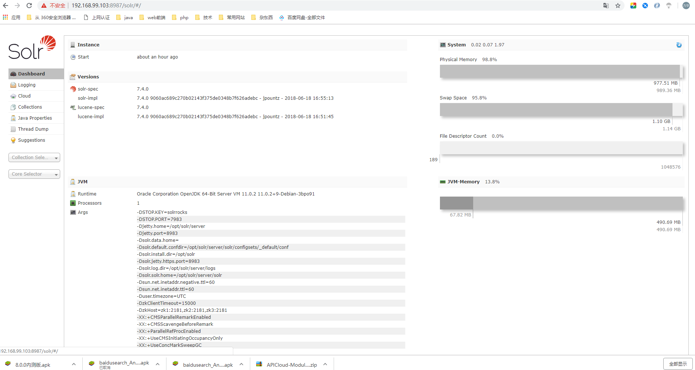

6. 上传配置文件 conf 到 ZooKeeper 中心；

   ```bash
   docker exec -it solrcloud1 /opt/solr/server/scripts/cloud-scripts/zkcli.sh -zkhost zk1:2181,zk2:2181,zk3:2181 -cmd upconfig -confdir /opt/solr/server/solr/configsets/sample_techproducts_configs/conf -confname solrcloud-conf
   
   ```

7. 查询zookeeper集群是否包含配置文件；

   ```bash
   docker exec -it zk1 /bin/bash
   bash-4.4# ./bin/zkCli.sh -server zk2:2181
   Connecting to zk2:2181
   ---日志省略---
   [zk:zk2:2181(CONNECTED) 0] ls /configs/solrcloud-conf
   [currency.xml, mapping-FoldToASCII.txt, managed-schema, protwords.txt, synonyms.txt, stopwords.txt, _schema_analysis_synonyms_english.json, velocity, update-script.js, _schema_analysis_stopwords_english.json, solrconfig.xml, elevate.xml, clustering, _rest_managed.json, mapping-ISOLatin1Accent.txt, spellings.txt, xslt, lang, params.json]
   ```

   请求：[http://192.168.18.129:8987/solr/admin/configs?action=LIST](http://192.168.18.129:8987/solr/admin/configs?action=LIST)

8. 更新配置文件；

   ```bash
   # 拷贝宿主机修改的目录上传至solr集群中某一节点 /usr/local/
   	docker cp solr/server/solr/collection1/conf/solrconfig.xml solrcloud1:/opt/solr/server/solr/configsets/sample_techproducts_configs/conf/solrconfig.xml
   	docker cp solr/server/solr/collection1/conf/managed-schema solrcloud1:/opt/solr/server/solr/configsets/sample_techproducts_configs/conf/managed-schema
    
    # 利用putfile命令更新集群的配置文件
   	docker exec -it solrcloud1 /opt/solr/server/scripts/cloud-scripts/zkcli.sh -zkhost zk1:2181,zk2:2181,zk3:2181 -cmd putfile /configs/solrcloud-conf/solrconfig.xml /opt/solr/server/solr/configsets/sample_techproducts_configs/conf/solrconfig.xml
   	docker exec -it solrcloud1 /opt/solr/server/scripts/cloud-scripts/zkcli.sh -zkhost zk1:2181,zk2:2181,zk3:2181 -cmd putfile /configs/solrcloud-conf/managed-schema /opt/solr/server/solr/configsets/sample_techproducts_configs/conf/managed-schema
   
   ```

9. 创建collection，分两片，每片一主一备。浏览器输入请求：

   - [http://192.168.18.129:8987/solr/admin/collections?action=CREATE&name=collection1&numShards=2&replicationFactor=2 ](http://192.168.18.129:8987/solr/admin/collections?action=CREATE&name=collection1&numShards=2&replicationFactor=2)
   - [http://192.168.18.129:8987/solr/admin/collections?action=CREATE&name=collection2&numShards=2&replicationFactor=2&collection.configName=solrcloud-conf ](http://192.168.18.129:8987/solr/admin/collections?action=CREATE&name=collection2&numShards=2&replicationFactor=2&collection.configName=solrcloud-conf)

   

10. 重新载入ZooKeeper更新后的配置文件。

    [http://192.168.18.129:8987/solr/admin/collections?action=RELOAD&name=collection1](http://192.168.18.129:8987/solr/admin/collections?action=RELOAD&name=collection1)

    [http://192.168.18.129:8987/solr/admin/collections?action=RELOAD&name=collection2](http://192.168.18.129:8987/solr/admin/collections?action=RELOAD&name=collection2)

     

11. 配置搜索文件

```xml
<field name="item_title" type="cn_text" indexed="true" stored="true"/>
<field name="item_sell_point" type="cn_text" indexed="true" stored="true"/>
<field name="item_price"  type="plong" indexed="true" stored="true"/>
<field name="item_image" type="string" indexed="false" stored="true" />
<field name="item_category_name" type="string" indexed="true" stored="true" />

<field name="item_keywords" type="cn_text" indexed="true" stored="false" multiValued="true"/>
<copyField source="item_title" dest="item_keywords"/>
<copyField source="item_sell_point" dest="item_keywords"/>
<copyField source="item_category_name" dest="item_keywords"/>
```


### ActiveMQ

1. [拉取 ActiveMQ 镜像](https://hub.docker.com/r/webcenter/activemq/)；

   ```bash
   docker pull webcenter/activemq:5.14.3
   ```

2. 启动容器实例；

    	docker run -d --name activemq -p 61616:61616 -p 8161:8161 webcenter/activemq:5.14.3	 

3. 宿主机开启防火墙端口8161和61616；

4. 访问 [http://ip:8161](http://ip:8161) 进入管理页面，默认登录账户密码均为 *admin*；

5.  引入 ActiveMQ依赖；

   ```xml
   <dependency>
       <groupId>org.springframework.boot</groupId>
       <artifactId>spring-boot-starter-activemq</artifactId>
   </dependency>
   <!--  启用JMS 的池化-->
   <dependency>
       <groupId>org.apache.activemq</groupId>
       <artifactId>activemq-pool</artifactId>
   </dependency>
   ```

6. 添加 ActiveMQ 配置文件；

   ```yaml
   spring:
     activemq:
       user: admin
       password: admin
       broker-url: tcp://192.168.18.129:61616
       pool:
         enabled: true
         max-connections: 50
       packages:
         trust-all: false
   ```


